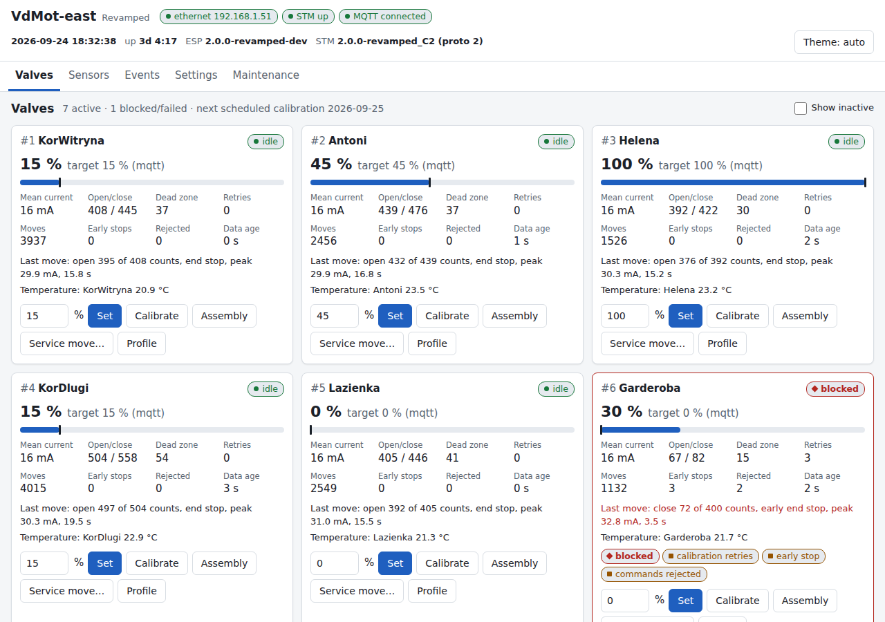
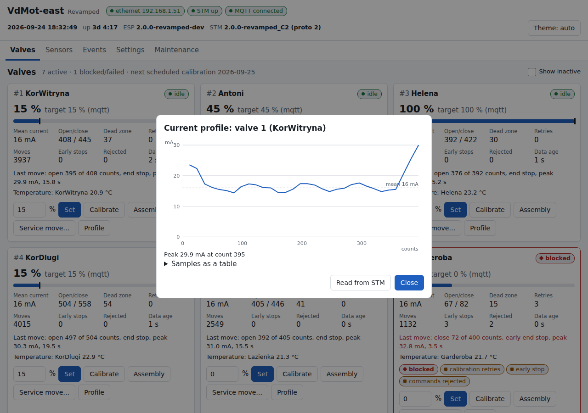
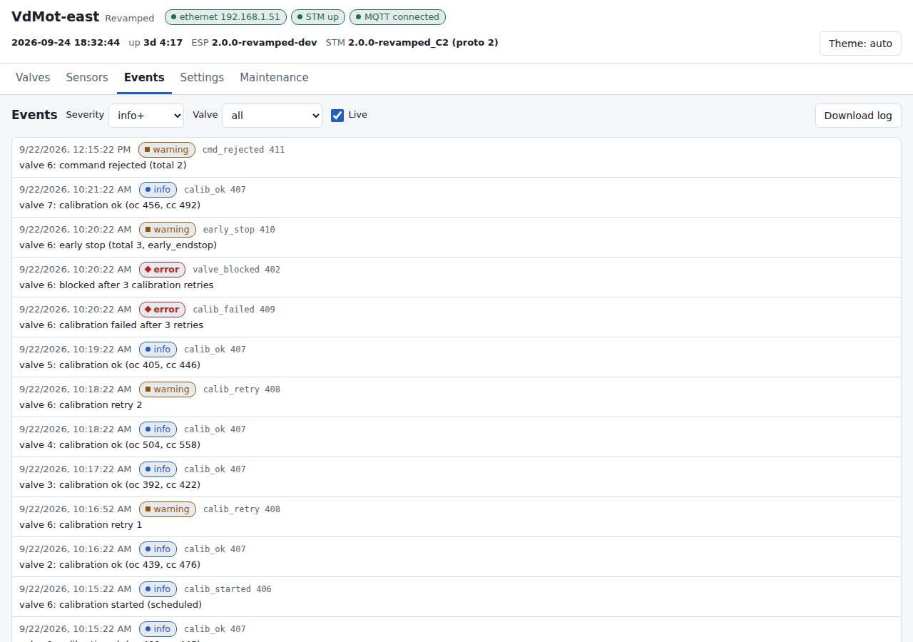
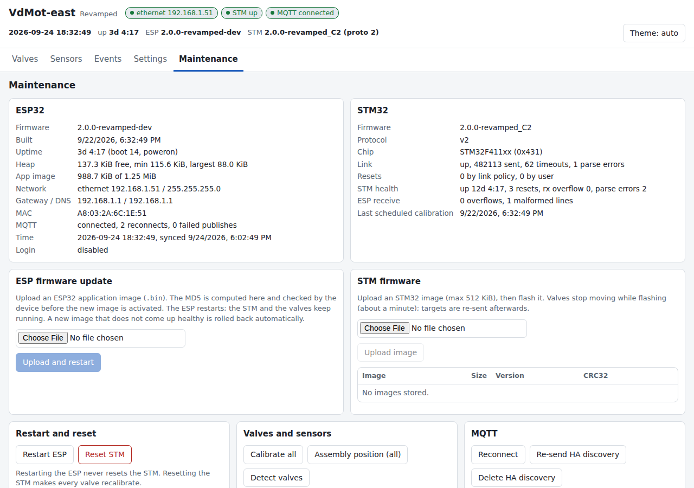
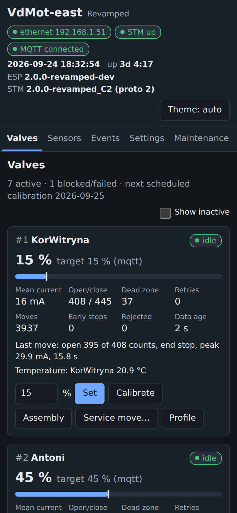

# VdMot Revamped

> **Unofficial.** VdMot Revamped is an independently maintained fork of the
> [VdMot_Controller](https://github.com/Lenti84/VdMot_Controller) firmware
> (Lenti84 / SurfGargano). It is not an official release and is not supported by
> the upstream project. Every artifact carries the suffix `-revamped`, so it
> cannot be confused with the official firmware.

Version: **2.0.0-revamped** (ESP32 and STM32).
Base: branch `hc-version` = upstream `developer` 1.4.12 plus the owner's fixes,
a pinned toolchain and CI.

## What it is

The VdMot controller has two MCUs: an STM32 (BlackPill F401/F411) that drives
the 12 valve motors and reads the 1-Wire sensors, and an ESP32 (WT32-ETH01)
that provides network, MQTT and the web UI and talks to the STM over UART.

VdMot Revamped changes both:

| Part | Upstream 1.4.x | VdMot Revamped |
|---|---|---|
| STM32 | valve control, calibration | same job, hardened; calibration fixes; move diagnostics; protocol v2 (new commands only) |
| ESP32 | `software_esp32` (PI controller, window logic, alarms, web UI) | new firmware `software_esp32_revamped`: precise valve control, dashboard, diagnostics, event log, HA discovery. No PI controller, no alarms |

Both halves are backwards compatible:
- the revamped STM works with the old ESP (protocol v1 is unchanged, v2 only adds commands);
- the new ESP works with an unmodified STM 1.4.x (it detects v1 and uses only v1 commands).

## What changed

### STM32 (2.0.0-revamped)
- **Hardening:** bounded UART/terminal line handling (CR, LF or CR LF; overlong
  or non-printable lines dropped and counted; partial lines dropped after
  100 ms), index checks before every array access, fixed ISR/main-loop races
  in the valve state machine, no blocking delay in ISR paths, watchdog fed
  only while the valve state machine makes progress, I2C bus recovery and
  EEPROM retries, 1-Wire bounds.
- **Calibration fixes:** end-stop thresholds from the learned mean current
  with a 15 mA floor (20 mA for calibration closing strokes); the mean current
  is learned only from a successful pass; a failed calibration never
  overwrites counts/scaler and leaves the valve **blocked** instead of
  reporting idle; failed/blocked valves no longer fake `actual = target`;
  the 60 mA safety limit counts consecutive samples; one validated range
  table for motor parameters; `staln` starts at once; targets are accepted
  during a calibration.
- **Diagnostics:** every move records direction, requested/counted pulses,
  stop reason, peak current and duration, plus a 32-point current profile;
  early end stops and rejected commands are counted.
- **Protocol v2** (new commands `gproto`, `gvlvx`, `gprof`, `svmov`, `scalx`,
  `gcalx`, `gstat`, `gmotx`): see [software_stm32/PROTOCOL_V2.md](../../software_stm32/PROTOCOL_V2.md),
  which also lists the few changed v1 behaviours (e.g. `smotc err` for
  out-of-range values).
- **Optional breakaway escalation:** calibration repetitions may raise the
  end-stop threshold step by step, capped by a configurable maximum (<= 60 mA).
- New release envs for the F411 BlackPill: `STM32F411_release_C1`, `STM32F411_release_C2`.

### ESP32 (new firmware, 2.0.0-revamped)
- **Precise valve control:** targets come only from MQTT or HTTP. Every target
  is delivered with read-back verification (re-sent until the STM confirms it),
  queued with priorities, and re-pushed after an STM restart. The ESP does
  **not** reset the STM when the ESP boots; it resets it only on user
  request, for flashing, or after a sustained link failure (>= 5 timeouts
  over >= 60 s, at most once per 10 min).
- **Dashboard** (single page, works on a phone, light/dark theme): valve cards
  with position/target, health chips, last move, current-profile chart, set
  target / calibrate / assembly / service move; sensors; live event log;
  settings; maintenance (ESP update, STM flashing with progress, backup).
- **Detailed logs:** structured event log (512 entries in RAM, 2 x 64 KB
  rotating file on LittleFS, optional syslog), downloadable. Only warnings
  and calibration outcomes go to MQTT, rate-limited.
- **MQTT:** legacy topics, payloads and retain flags unchanged; new
  `diag/...`, `events` and `status` (LWT) topics. See [MQTT.md](MQTT.md).
- **Home Assistant discovery:** legacy entities keep their unique_ids; new
  diagnostic entities; entities of removed features are deleted once.
- **Legacy config import:** on first boot the legacy NVS settings (network,
  MQTT, names, sensor mapping, calibration schedule, web login) are imported
  once. Legacy keys are never modified, so a downgrade finds them.
- **OTA with rollback:** a new ESP image must prove itself healthy (network +
  STM link) or it is rolled back automatically; the STM is flashed from the
  dashboard with chip-ID check and read-back verification.
- **HTTP JSON API** with optional HTTP Basic auth and brute-force lockout.
  See [API.md](API.md).
- Scheduled calibration by weekday mask, hour and minute (DST-safe).
- Same partition table as the legacy firmware (upgrade is a normal OTA).

### Removed (new ESP)
- PI/room temperature control, heat/cool modes, park position, window logic
  and the related MQTT topics and HA entities (`climate`, `control/*`,
  `window/*`, `tTarget`, `tValue`, `heatControl`, `parkPosition`).
- Alarms and notifications (Pushover, e-mail).
- °F display (°C only).
- The legacy web UI pages (replaced by the dashboard and `/api/*`).

If you need a room thermostat, run it in Home Assistant (or similar) and send
valve targets over MQTT.

## Screenshots

| Current profile of the last move | Event log |
|---|---|
|  |  |

| Maintenance | Phone |
|---|---|
|  |  |

(Screenshots from `software_esp32_revamped/tools/mock_api.py` with simulated data.)

## Testing

- **Native unit tests** (host, doctest, `-Wall -Wextra -Werror`, AddressSanitizer +
  UBSan) for all decision logic, which lives in hardware-free cores:
  `software_stm32/lib/core` (16 modules, 189 test cases) and
  `software_esp32_revamped/lib/core` (18 modules, 500 test cases). Parsers
  get fixed-seed random-input tests.
- **Mutation testing** (`tools/mutation/mutate.py`, bar 85 %):
  STM core **96.8 %** ([report](mutation-stm32.md)),
  ESP core **95.4 %** ([report](mutation-esp32.md)).
- **Build checks** of every STM env and both ESP firmwares; ESP image size budget
  1.2 MB (partition 1.25 MB).
- On-device behaviour: manual checklist in [INSTALL.md](INSTALL.md#4-after-the-upgrade-checklist).

## CI/CD

`.github/workflows/build.yml` (pinned PlatformIO 6.1.19, esptool 4.11.0, platforms and libraries):

| Job | When | What |
|---|---|---|
| native | push / PR | native tests of both cores, mutation tool self-test |
| mutation | push / PR (changed core files), weekly and manual (all) | informational, does not block a release |
| stm32 | push / PR | `STM32_release_C1/C2`, `STM32F411_release_C1/C2` |
| esp32 | push / PR | revamped + legacy ESP, digest-less image, size check |
| release | tag `v*-revamped` | `tools/release/package.py`, GitHub Release (pre-release for `-rc`) |
| release-legacy | other `v*` tags | legacy binaries as before |

## Pull request stack

| Branch | Base | Content |
|---|---|---|
| `revamped/stm-hardening` | `hc-version` | STM fixes only (upstream-friendly), core library + native tests, F411 envs |
| `revamped/stm-calibration` | `stm-hardening` | calibration fixes, move diagnostics, protocol v2 |
| `revamped/esp-legacy-fixes` | `hc-version` | bug fixes for the legacy `software_esp32` (no features); independent of the rest |
| `revamped/esp-new` | `stm-calibration` | new ESP firmware `software_esp32_revamped` |
| `revamped/ci-release` | `esp-new` | CI, mutation configs and reports, release packaging, these docs |

## Documentation

- [INSTALL.md](INSTALL.md): building, release assets, upgrade, rollback, recovery
- [MQTT.md](MQTT.md): topics and Home Assistant entities
- [API.md](API.md): HTTP JSON API
- [CHANGELOG.md](CHANGELOG.md)
- [software_stm32/PROTOCOL_V2.md](../../software_stm32/PROTOCOL_V2.md): UART protocol v2
- [software_esp32_revamped/DESIGN.md](../../software_esp32_revamped/DESIGN.md): ESP design (internals)
- [mutation-stm32.md](mutation-stm32.md), [mutation-esp32.md](mutation-esp32.md)
